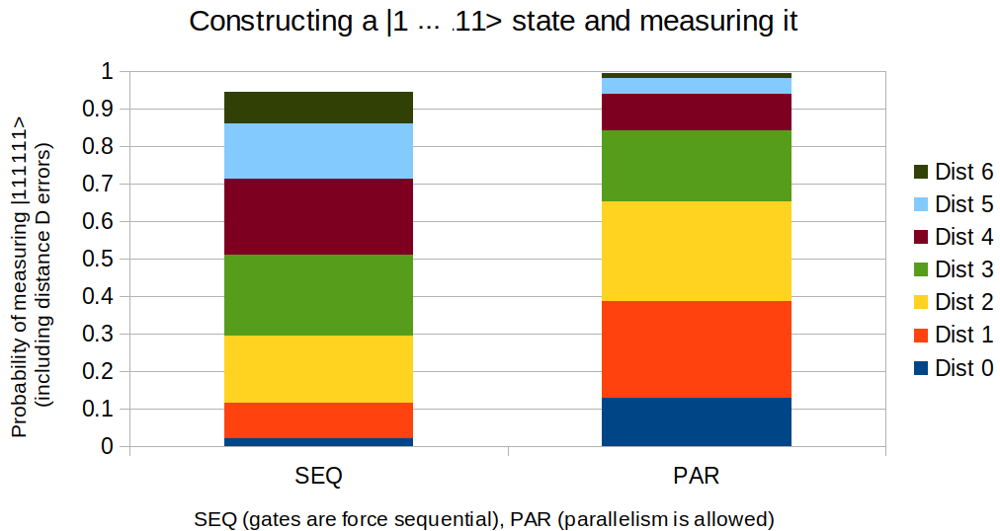
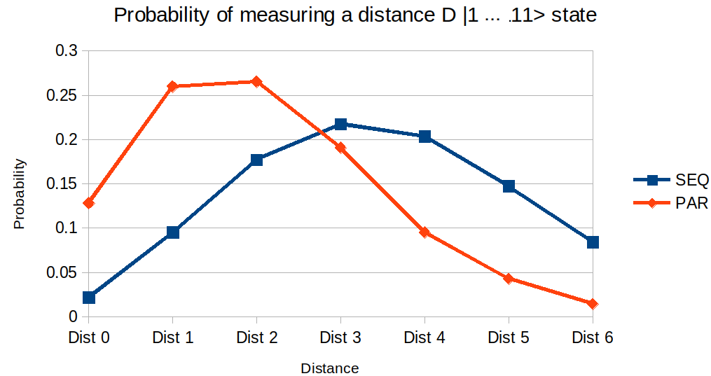

# Error-rates and duration of sequential and parallel CNOTs

The following two experiments were designed to get a clue if
- circuits with parallel CNOTs are really executed in parallel?
- is for parallel CNOTs the error rate higher than for the sequential circuits?

The architecture of imbq_16_melbourne has two rows of qubits.


## Construct a |111111111111> state and measure it


**Fig. 1**: The qubits are initialized according to the diagram below and interacted by CNOTs (green lines).
Afterwards all the qubits are measured.


- The top row is initialized to |000111>
- The bottom row is initialized to |111000>

There are two types of circuits used to construct |111 111 111 111>: SEQuential and PARallel (see below the circuit diagrams).

The error-rate of PAR and SEQ is influenced by factors like T1/T2 qubit times, measurements, and length of the CNOT circuit.
It is not obvious how much influence each of those factors have, but by keeping everything constant, 
and varying the CNOT part, some observations about the time duration of the CNOT part can be made
(ie. the longer the higher the error probability).

**Assumption**: If PAR would be executed sequentially its error rate (reflected in wrong |1...1> states) 
should be at least equal to probabilities from SEQ.



**Fig. 2**: Blue represents the perfect state being measured. For SEQ the probability is around 1%, whereas for PAR around 10%.
Orange is the probability of measuring a distance-1 flipped |1..1> (e.g. |101111...1>). The cumulated probability
for SEQ for blue+orange is around 10%, while for PAR almost 40%.

**Observation**: 
- PAR seems to introduce less errors. Seems to be executed in parallel, and seems 
to introduce a lot fewer errors.
- Execution times are unknown, although it seems error-rates are lower.

**Question**: Is there a way to express execution time, relatively to something that is chip related? 
The following experiment tries to do this. 



**Fig. 3**: Distribution of probabilities for SEQ and PAR.

**Note**: CNOTs may be combined behind the scene to a short pulse sequence, such that the error
rate of those CNOTs is not the error rate one would expect when CNOTs are individually considered as. Error rate
may be lower.

### Expressing the error-rate of SEQ and PAR as a kind of T1 affecting |111111111111>

Without knowing how PAR and SEQ are executed behind the scene, and what their total error-rate is, the question 
that could be asked is: can the error-rate of the circuits be explained by a synthetic measure?

For example, how much time would it take for the perfect |1...1> (a repetition code) to be affected by noise 
such that D single errors (distance-D from perfect) appear. Time could be measured in discrete time units, 
such as the duration of a real CNOT from the chip that is not applied to the |1...1> state 
(eg. between Q0 and Q1).

**Goal**: Express the error rate of SEQ and MEAS as a function of MEAS circuit duration.


**Fig. 4**: The unit-time CNOT is green. The qubits are initialised in |1> and kept alive for a number of CNOTs. See below the MEAS
circuit where the 12 qubits are kept for the duration of 20 CNOTs.


**Fig. 5**: The horizontal axis shows the number of the same CNOT executed (depth of the MEAS circuit). For example, for the 
2 CNOT MEAS circuit there is a 20% probability (blue) of measuring the error-free |1..1> state.

**Observation**: 
- The probability of measuring distance-0 or distance-1 |1..1> states after SEQ is approx. 10%, which
corresponds to executing a MEAS circuit of depth 12. Thus, error-rate of SEQ is as if the |1..1> qubits were left idling
for 12 CNOTs between Q0-Q1.

- The probability of measuring distance-0 or distance-1 |1..1> states after PAR is approx. 40%, which
corresponds to executing a MEAS circuit of depth 4. Thus, error-rate of SEQ is as if the |1..1> qubits were left idling
for 4 CNOTs between Q0-Q1.

- PAR seems to have the error-rate as if it would have a speed-up of 12/4=3.


## Used circuits

### SEQuential
```
 q0_0: |0>──────░───────░───────░───────░───────░───────░───────░──░─┤M├───────────────────────────────────────
                ░ ┌───┐ ░       ░       ░       ░       ░       ░  ░ └╥┘┌─┐                                    
 q0_1: |0>──────░─┤ X ├─░───────░───────░───────░───────░───────░──░──╫─┤M├────────────────────────────────────
                ░ └─┬─┘ ░ ┌───┐ ░       ░       ░       ░       ░  ░  ║ └╥┘┌─┐                                 
 q0_2: |0>──────░───┼───░─┤ X ├─░───────░───────░───────░───────░──░──╫──╫─┤M├─────────────────────────────────
                ░   │   ░ └─┬─┘ ░ ┌───┐ ░       ░       ░       ░  ░  ║  ║ └╥┘┌─┐                              
 q0_3: |0>──────░───┼───░───┼───░─┤ X ├─░───────░───────░───────░──░──╫──╫──╫─┤M├──────────────────────────────
          ┌───┐ ░   │   ░   │   ░ └─┬─┘ ░       ░       ░       ░  ░  ║  ║  ║ └╥┘┌─┐                           
 q0_4: |0>┤ X ├─░───┼───░───┼───░───┼───░───■───░───────░───────░──░──╫──╫──╫──╫─┤M├───────────────────────────
          ├───┤ ░   │   ░   │   ░   │   ░   │   ░       ░       ░  ░  ║  ║  ║  ║ └╥┘┌─┐                        
 q0_5: |0>┤ X ├─░───┼───░───┼───░───┼───░───┼───░───■───░───────░──░──╫──╫──╫──╫──╫─┤M├────────────────────────
          ├───┤ ░   │   ░   │   ░   │   ░   │   ░   │   ░       ░  ░  ║  ║  ║  ║  ║ └╥┘┌─┐                     
 q0_6: |0>┤ X ├─░───┼───░───┼───░───┼───░───┼───░───┼───░───■───░──░──╫──╫──╫──╫──╫──╫─┤M├─────────────────────
          └───┘ ░   │   ░   │   ░   │   ░   │   ░   │   ░   │   ░  ░  ║  ║  ║  ║  ║  ║ └╥┘┌─┐                  
 q0_7: |0>──────░───┼───░───┼───░───┼───░───┼───░───┼───░───┼───░──░──╫──╫──╫──╫──╫──╫──╫─┤M├──────────────────
                ░   │   ░   │   ░   │   ░   │   ░   │   ░ ┌─┴─┐ ░  ░  ║  ║  ║  ║  ║  ║  ║ └╥┘┌─┐               
 q0_8: |0>──────░───┼───░───┼───░───┼───░───┼───░───┼───░─┤ X ├─░──░──╫──╫──╫──╫──╫──╫──╫──╫─┤M├───────────────
                ░   │   ░   │   ░   │   ░   │   ░ ┌─┴─┐ ░ └───┘ ░  ░  ║  ║  ║  ║  ║  ║  ║  ║ └╥┘┌─┐            
 q0_9: |0>──────░───┼───░───┼───░───┼───░───┼───░─┤ X ├─░───────░──░──╫──╫──╫──╫──╫──╫──╫──╫──╫─┤M├────────────
                ░   │   ░   │   ░   │   ░ ┌─┴─┐ ░ └───┘ ░       ░  ░  ║  ║  ║  ║  ║  ║  ║  ║  ║ └╥┘┌─┐         
q0_10: |0>──────░───┼───░───┼───░───┼───░─┤ X ├─░───────░───────░──░──╫──╫──╫──╫──╫──╫──╫──╫──╫──╫─┤M├─────────
          ┌───┐ ░   │   ░   │   ░   │   ░ └───┘ ░       ░       ░  ░  ║  ║  ║  ║  ║  ║  ║  ║  ║  ║ └╥┘┌─┐      
q0_11: |0>┤ X ├─░───┼───░───┼───░───■───░───────░───────░───────░──░──╫──╫──╫──╫──╫──╫──╫──╫──╫──╫──╫─┤M├──────
          ├───┤ ░   │   ░   │   ░       ░       ░       ░       ░  ░  ║  ║  ║  ║  ║  ║  ║  ║  ║  ║  ║ └╥┘┌─┐   
q0_12: |0>┤ X ├─░───┼───░───■───░───────░───────░───────░───────░──░──╫──╫──╫──╫──╫──╫──╫──╫──╫──╫──╫──╫─┤M├───
          ├───┤ ░   │   ░       ░       ░       ░       ░       ░  ░  ║  ║  ║  ║  ║  ║  ║  ║  ║  ║  ║  ║ └╥┘┌─┐
q0_13: |0>┤ X ├─░───■───░───────░───────░───────░───────░───────░──░──╫──╫──╫──╫──╫──╫──╫──╫──╫──╫──╫──╫──╫─┤M├
          └───┘ ░       ░       ░       ░       ░       ░       ░  ░  ║  ║  ║  ║  ║  ║  ║  ║  ║  ║  ║  ║  ║ └╥┘
  c0_0: 0 ════════════════════════════════════════════════════════════╩══╬══╬══╬══╬══╬══╬══╬══╬══╬══╬══╬══╬══╬═
                                                                         ║  ║  ║  ║  ║  ║  ║  ║  ║  ║  ║  ║  ║ 
  c0_1: 0 ═══════════════════════════════════════════════════════════════╩══╬══╬══╬══╬══╬══╬══╬══╬══╬══╬══╬══╬═
                                                                            ║  ║  ║  ║  ║  ║  ║  ║  ║  ║  ║  ║ 
  c0_2: 0 ══════════════════════════════════════════════════════════════════╩══╬══╬══╬══╬══╬══╬══╬══╬══╬══╬══╬═
                                                                               ║  ║  ║  ║  ║  ║  ║  ║  ║  ║  ║ 
  c0_3: 0 ═════════════════════════════════════════════════════════════════════╩══╬══╬══╬══╬══╬══╬══╬══╬══╬══╬═
                                                                                  ║  ║  ║  ║  ║  ║  ║  ║  ║  ║ 
  c0_4: 0 ════════════════════════════════════════════════════════════════════════╩══╬══╬══╬══╬══╬══╬══╬══╬══╬═
                                                                                     ║  ║  ║  ║  ║  ║  ║  ║  ║ 
  c0_5: 0 ═══════════════════════════════════════════════════════════════════════════╩══╬══╬══╬══╬══╬══╬══╬══╬═
                                                                                        ║  ║  ║  ║  ║  ║  ║  ║ 
  c0_6: 0 ══════════════════════════════════════════════════════════════════════════════╩══╬══╬══╬══╬══╬══╬══╬═
                                                                                           ║  ║  ║  ║  ║  ║  ║ 
  c0_7: 0 ═════════════════════════════════════════════════════════════════════════════════╩══╬══╬══╬══╬══╬══╬═
                                                                                              ║  ║  ║  ║  ║  ║ 
  c0_8: 0 ════════════════════════════════════════════════════════════════════════════════════╩══╬══╬══╬══╬══╬═
                                                                                                 ║  ║  ║  ║  ║ 
  c0_9: 0 ═══════════════════════════════════════════════════════════════════════════════════════╩══╬══╬══╬══╬═
                                                                                                    ║  ║  ║  ║ 
 c0_10: 0 ══════════════════════════════════════════════════════════════════════════════════════════╩══╬══╬══╬═
                                                                                                       ║  ║  ║ 
 c0_11: 0 ═════════════════════════════════════════════════════════════════════════════════════════════╩══╬══╬═
                                                                                                          ║  ║ 
 c0_12: 0 ════════════════════════════════════════════════════════════════════════════════════════════════╩══╬═
                                                                                                             ║ 
 c0_13: 0 ═══════════════════════════════════════════════════════════════════════════════════════════════════╩═
```

### PARallel
```                                                                                                               
                ░                                ░ ┌─┐                                       
 q1_0: |0>──────░────────────────────────────────░─┤M├───────────────────────────────────────
                ░ ┌───┐                          ░ └╥┘┌─┐                                    
 q1_1: |0>──────░─┤ X ├──────────────────────────░──╫─┤M├────────────────────────────────────
                ░ └─┬─┘┌───┐                     ░  ║ └╥┘┌─┐                                 
 q1_2: |0>──────░───┼──┤ X ├─────────────────────░──╫──╫─┤M├─────────────────────────────────
                ░   │  └─┬─┘┌───┐                ░  ║  ║ └╥┘┌─┐                              
 q1_3: |0>──────░───┼────┼──┤ X ├────────────────░──╫──╫──╫─┤M├──────────────────────────────
          ┌───┐ ░   │    │  └─┬─┘                ░  ║  ║  ║ └╥┘┌─┐                           
 q1_4: |0>┤ X ├─░───┼────┼────┼────■─────────────░──╫──╫──╫──╫─┤M├───────────────────────────
          ├───┤ ░   │    │    │    │             ░  ║  ║  ║  ║ └╥┘┌─┐                        
 q1_5: |0>┤ X ├─░───┼────┼────┼────┼────■────────░──╫──╫──╫──╫──╫─┤M├────────────────────────
          ├───┤ ░   │    │    │    │    │        ░  ║  ║  ║  ║  ║ └╥┘┌─┐                     
 q1_6: |0>┤ X ├─░───┼────┼────┼────┼────┼────■───░──╫──╫──╫──╫──╫──╫─┤M├─────────────────────
          └───┘ ░   │    │    │    │    │    │   ░  ║  ║  ║  ║  ║  ║ └╥┘┌─┐                  
 q1_7: |0>──────░───┼────┼────┼────┼────┼────┼───░──╫──╫──╫──╫──╫──╫──╫─┤M├──────────────────
                ░   │    │    │    │    │  ┌─┴─┐ ░  ║  ║  ║  ║  ║  ║  ║ └╥┘┌─┐               
 q1_8: |0>──────░───┼────┼────┼────┼────┼──┤ X ├─░──╫──╫──╫──╫──╫──╫──╫──╫─┤M├───────────────
                ░   │    │    │    │  ┌─┴─┐└───┘ ░  ║  ║  ║  ║  ║  ║  ║  ║ └╥┘┌─┐            
 q1_9: |0>──────░───┼────┼────┼────┼──┤ X ├──────░──╫──╫──╫──╫──╫──╫──╫──╫──╫─┤M├────────────
                ░   │    │    │  ┌─┴─┐└───┘      ░  ║  ║  ║  ║  ║  ║  ║  ║  ║ └╥┘┌─┐         
q1_10: |0>──────░───┼────┼────┼──┤ X ├───────────░──╫──╫──╫──╫──╫──╫──╫──╫──╫──╫─┤M├─────────
          ┌───┐ ░   │    │    │  └───┘           ░  ║  ║  ║  ║  ║  ║  ║  ║  ║  ║ └╥┘┌─┐      
q1_11: |0>┤ X ├─░───┼────┼────■──────────────────░──╫──╫──╫──╫──╫──╫──╫──╫──╫──╫──╫─┤M├──────
          ├───┤ ░   │    │                       ░  ║  ║  ║  ║  ║  ║  ║  ║  ║  ║  ║ └╥┘┌─┐   
q1_12: |0>┤ X ├─░───┼────■───────────────────────░──╫──╫──╫──╫──╫──╫──╫──╫──╫──╫──╫──╫─┤M├───
          ├───┤ ░   │                            ░  ║  ║  ║  ║  ║  ║  ║  ║  ║  ║  ║  ║ └╥┘┌─┐
q1_13: |0>┤ X ├─░───■────────────────────────────░──╫──╫──╫──╫──╫──╫──╫──╫──╫──╫──╫──╫──╫─┤M├
          └───┘ ░                                ░  ║  ║  ║  ║  ║  ║  ║  ║  ║  ║  ║  ║  ║ └╥┘
  c1_0: 0 ══════════════════════════════════════════╩══╬══╬══╬══╬══╬══╬══╬══╬══╬══╬══╬══╬══╬═
                                                       ║  ║  ║  ║  ║  ║  ║  ║  ║  ║  ║  ║  ║ 
  c1_1: 0 ═════════════════════════════════════════════╩══╬══╬══╬══╬══╬══╬══╬══╬══╬══╬══╬══╬═
                                                          ║  ║  ║  ║  ║  ║  ║  ║  ║  ║  ║  ║ 
  c1_2: 0 ════════════════════════════════════════════════╩══╬══╬══╬══╬══╬══╬══╬══╬══╬══╬══╬═
                                                             ║  ║  ║  ║  ║  ║  ║  ║  ║  ║  ║ 
  c1_3: 0 ═══════════════════════════════════════════════════╩══╬══╬══╬══╬══╬══╬══╬══╬══╬══╬═
                                                                ║  ║  ║  ║  ║  ║  ║  ║  ║  ║ 
  c1_4: 0 ══════════════════════════════════════════════════════╩══╬══╬══╬══╬══╬══╬══╬══╬══╬═
                                                                   ║  ║  ║  ║  ║  ║  ║  ║  ║ 
  c1_5: 0 ═════════════════════════════════════════════════════════╩══╬══╬══╬══╬══╬══╬══╬══╬═
                                                                      ║  ║  ║  ║  ║  ║  ║  ║ 
  c1_6: 0 ════════════════════════════════════════════════════════════╩══╬══╬══╬══╬══╬══╬══╬═
                                                                         ║  ║  ║  ║  ║  ║  ║ 
  c1_7: 0 ═══════════════════════════════════════════════════════════════╩══╬══╬══╬══╬══╬══╬═
                                                                            ║  ║  ║  ║  ║  ║ 
  c1_8: 0 ══════════════════════════════════════════════════════════════════╩══╬══╬══╬══╬══╬═
                                                                               ║  ║  ║  ║  ║ 
  c1_9: 0 ═════════════════════════════════════════════════════════════════════╩══╬══╬══╬══╬═
                                                                                  ║  ║  ║  ║ 
 c1_10: 0 ════════════════════════════════════════════════════════════════════════╩══╬══╬══╬═
                                                                                     ║  ║  ║ 
 c1_11: 0 ═══════════════════════════════════════════════════════════════════════════╩══╬══╬═
                                                                                        ║  ║ 
 c1_12: 0 ══════════════════════════════════════════════════════════════════════════════╩══╬═
                                                                                           ║ 
 c1_13: 0 ═════════════════════════════════════════════════════════════════════════════════╩═
``` 

### MEASure time with CNOTs - here 20 CNOTs/units of time
```
           ┌───┐ ░       ░ ┌───┐ ░ ┌───┐ ░ ┌───┐ ░ ┌───┐ ░ ┌───┐ ░ ┌───┐ ░ ┌───┐ ░ ┌───┐ ░ ┌───┐ ░ ┌───┐ ░ ┌───┐ ░ ┌───┐ ░ ┌───┐ ░ ┌───┐ ░ ┌───┐ ░ ┌───┐ ░ ┌───┐ ░ ┌───┐ ░ ┌───┐ ░ ┌───┐ ░  ░                                     
 q10_0: |0>┤ X ├─░───────░─┤ X ├─░─┤ X ├─░─┤ X ├─░─┤ X ├─░─┤ X ├─░─┤ X ├─░─┤ X ├─░─┤ X ├─░─┤ X ├─░─┤ X ├─░─┤ X ├─░─┤ X ├─░─┤ X ├─░─┤ X ├─░─┤ X ├─░─┤ X ├─░─┤ X ├─░─┤ X ├─░─┤ X ├─░─┤ X ├─░──░─────────────────────────────────────
           ├───┤ ░       ░ └─┬─┘ ░ └─┬─┘ ░ └─┬─┘ ░ └─┬─┘ ░ └─┬─┘ ░ └─┬─┘ ░ └─┬─┘ ░ └─┬─┘ ░ └─┬─┘ ░ └─┬─┘ ░ └─┬─┘ ░ └─┬─┘ ░ └─┬─┘ ░ └─┬─┘ ░ └─┬─┘ ░ └─┬─┘ ░ └─┬─┘ ░ └─┬─┘ ░ └─┬─┘ ░ └─┬─┘ ░  ░                                     
 q10_1: |0>┤ X ├─░───────░───■───░───■───░───■───░───■───░───■───░───■───░───■───░───■───░───■───░───■───░───■───░───■───░───■───░───■───░───■───░───■───░───■───░───■───░───■───░───■───░──░─────────────────────────────────────
           └───┘ ░ ┌───┐ ░       ░       ░       ░       ░       ░       ░       ░       ░       ░       ░       ░       ░       ░       ░       ░       ░       ░       ░       ░       ░  ░ ┌─┐                                 
 q10_2: |0>──────░─┤ X ├─░───────░───────░───────░───────░───────░───────░───────░───────░───────░───────░───────░───────░───────░───────░───────░───────░───────░───────░───────░───────░──░─┤M├─────────────────────────────────
                 ░ ├───┤ ░       ░       ░       ░       ░       ░       ░       ░       ░       ░       ░       ░       ░       ░       ░       ░       ░       ░       ░       ░       ░  ░ └╥┘┌─┐                              
 q10_3: |0>──────░─┤ X ├─░───────░───────░───────░───────░───────░───────░───────░───────░───────░───────░───────░───────░───────░───────░───────░───────░───────░───────░───────░───────░──░──╫─┤M├──────────────────────────────
                 ░ ├───┤ ░       ░       ░       ░       ░       ░       ░       ░       ░       ░       ░       ░       ░       ░       ░       ░       ░       ░       ░       ░       ░  ░  ║ └╥┘┌─┐                           
 q10_4: |0>──────░─┤ X ├─░───────░───────░───────░───────░───────░───────░───────░───────░───────░───────░───────░───────░───────░───────░───────░───────░───────░───────░───────░───────░──░──╫──╫─┤M├───────────────────────────
                 ░ ├───┤ ░       ░       ░       ░       ░       ░       ░       ░       ░       ░       ░       ░       ░       ░       ░       ░       ░       ░       ░       ░       ░  ░  ║  ║ └╥┘┌─┐                        
 q10_5: |0>──────░─┤ X ├─░───────░───────░───────░───────░───────░───────░───────░───────░───────░───────░───────░───────░───────░───────░───────░───────░───────░───────░───────░───────░──░──╫──╫──╫─┤M├────────────────────────
                 ░ ├───┤ ░       ░       ░       ░       ░       ░       ░       ░       ░       ░       ░       ░       ░       ░       ░       ░       ░       ░       ░       ░       ░  ░  ║  ║  ║ └╥┘┌─┐                     
 q10_6: |0>──────░─┤ X ├─░───────░───────░───────░───────░───────░───────░───────░───────░───────░───────░───────░───────░───────░───────░───────░───────░───────░───────░───────░───────░──░──╫──╫──╫──╫─┤M├─────────────────────
                 ░ ├───┤ ░       ░       ░       ░       ░       ░       ░       ░       ░       ░       ░       ░       ░       ░       ░       ░       ░       ░       ░       ░       ░  ░  ║  ║  ║  ║ └╥┘┌─┐                  
 q10_7: |0>──────░─┤ X ├─░───────░───────░───────░───────░───────░───────░───────░───────░───────░───────░───────░───────░───────░───────░───────░───────░───────░───────░───────░───────░──░──╫──╫──╫──╫──╫─┤M├──────────────────
                 ░ ├───┤ ░       ░       ░       ░       ░       ░       ░       ░       ░       ░       ░       ░       ░       ░       ░       ░       ░       ░       ░       ░       ░  ░  ║  ║  ║  ║  ║ └╥┘┌─┐               
 q10_8: |0>──────░─┤ X ├─░───────░───────░───────░───────░───────░───────░───────░───────░───────░───────░───────░───────░───────░───────░───────░───────░───────░───────░───────░───────░──░──╫──╫──╫──╫──╫──╫─┤M├───────────────
                 ░ ├───┤ ░       ░       ░       ░       ░       ░       ░       ░       ░       ░       ░       ░       ░       ░       ░       ░       ░       ░       ░       ░       ░  ░  ║  ║  ║  ║  ║  ║ └╥┘┌─┐            
 q10_9: |0>──────░─┤ X ├─░───────░───────░───────░───────░───────░───────░───────░───────░───────░───────░───────░───────░───────░───────░───────░───────░───────░───────░───────░───────░──░──╫──╫──╫──╫──╫──╫──╫─┤M├────────────
                 ░ ├───┤ ░       ░       ░       ░       ░       ░       ░       ░       ░       ░       ░       ░       ░       ░       ░       ░       ░       ░       ░       ░       ░  ░  ║  ║  ║  ║  ║  ║  ║ └╥┘┌─┐         
q10_10: |0>──────░─┤ X ├─░───────░───────░───────░───────░───────░───────░───────░───────░───────░───────░───────░───────░───────░───────░───────░───────░───────░───────░───────░───────░──░──╫──╫──╫──╫──╫──╫──╫──╫─┤M├─────────
                 ░ ├───┤ ░       ░       ░       ░       ░       ░       ░       ░       ░       ░       ░       ░       ░       ░       ░       ░       ░       ░       ░       ░       ░  ░  ║  ║  ║  ║  ║  ║  ║  ║ └╥┘┌─┐      
q10_11: |0>──────░─┤ X ├─░───────░───────░───────░───────░───────░───────░───────░───────░───────░───────░───────░───────░───────░───────░───────░───────░───────░───────░───────░───────░──░──╫──╫──╫──╫──╫──╫──╫──╫──╫─┤M├──────
                 ░ ├───┤ ░       ░       ░       ░       ░       ░       ░       ░       ░       ░       ░       ░       ░       ░       ░       ░       ░       ░       ░       ░       ░  ░  ║  ║  ║  ║  ║  ║  ║  ║  ║ └╥┘┌─┐   
q10_12: |0>──────░─┤ X ├─░───────░───────░───────░───────░───────░───────░───────░───────░───────░───────░───────░───────░───────░───────░───────░───────░───────░───────░───────░───────░──░──╫──╫──╫──╫──╫──╫──╫──╫──╫──╫─┤M├───
                 ░ ├───┤ ░       ░       ░       ░       ░       ░       ░       ░       ░       ░       ░       ░       ░       ░       ░       ░       ░       ░       ░       ░       ░  ░  ║  ║  ║  ║  ║  ║  ║  ║  ║  ║ └╥┘┌─┐
q10_13: |0>──────░─┤ X ├─░───────░───────░───────░───────░───────░───────░───────░───────░───────░───────░───────░───────░───────░───────░───────░───────░───────░───────░───────░───────░──░──╫──╫──╫──╫──╫──╫──╫──╫──╫──╫──╫─┤M├
                 ░ └───┘ ░       ░       ░       ░       ░       ░       ░       ░       ░       ░       ░       ░       ░       ░       ░       ░       ░       ░       ░       ░       ░  ░  ║  ║  ║  ║  ║  ║  ║  ║  ║  ║  ║ └╥┘
  c10_0: 0 ════════════════════════════════════════════════════════════════════════════════════════════════════════════════════════════════════════════════════════════════════════════════════╬══╬══╬══╬══╬══╬══╬══╬══╬══╬══╬══╬═
                                                                                                                                                                                               ║  ║  ║  ║  ║  ║  ║  ║  ║  ║  ║  ║ 
  c10_1: 0 ════════════════════════════════════════════════════════════════════════════════════════════════════════════════════════════════════════════════════════════════════════════════════╬══╬══╬══╬══╬══╬══╬══╬══╬══╬══╬══╬═
                                                                                                                                                                                               ║  ║  ║  ║  ║  ║  ║  ║  ║  ║  ║  ║ 
  c10_2: 0 ════════════════════════════════════════════════════════════════════════════════════════════════════════════════════════════════════════════════════════════════════════════════════╩══╬══╬══╬══╬══╬══╬══╬══╬══╬══╬══╬═
                                                                                                                                                                                                  ║  ║  ║  ║  ║  ║  ║  ║  ║  ║  ║ 
  c10_3: 0 ═══════════════════════════════════════════════════════════════════════════════════════════════════════════════════════════════════════════════════════════════════════════════════════╩══╬══╬══╬══╬══╬══╬══╬══╬══╬══╬═
                                                                                                                                                                                                     ║  ║  ║  ║  ║  ║  ║  ║  ║  ║ 
  c10_4: 0 ══════════════════════════════════════════════════════════════════════════════════════════════════════════════════════════════════════════════════════════════════════════════════════════╩══╬══╬══╬══╬══╬══╬══╬══╬══╬═
                                                                                                                                                                                                        ║  ║  ║  ║  ║  ║  ║  ║  ║ 
  c10_5: 0 ═════════════════════════════════════════════════════════════════════════════════════════════════════════════════════════════════════════════════════════════════════════════════════════════╩══╬══╬══╬══╬══╬══╬══╬══╬═
                                                                                                                                                                                                           ║  ║  ║  ║  ║  ║  ║  ║ 
  c10_6: 0 ════════════════════════════════════════════════════════════════════════════════════════════════════════════════════════════════════════════════════════════════════════════════════════════════╩══╬══╬══╬══╬══╬══╬══╬═
                                                                                                                                                                                                              ║  ║  ║  ║  ║  ║  ║ 
  c10_7: 0 ═══════════════════════════════════════════════════════════════════════════════════════════════════════════════════════════════════════════════════════════════════════════════════════════════════╩══╬══╬══╬══╬══╬══╬═
                                                                                                                                                                                                                 ║  ║  ║  ║  ║  ║ 
  c10_8: 0 ══════════════════════════════════════════════════════════════════════════════════════════════════════════════════════════════════════════════════════════════════════════════════════════════════════╩══╬══╬══╬══╬══╬═
                                                                                                                                                                                                                    ║  ║  ║  ║  ║ 
  c10_9: 0 ═════════════════════════════════════════════════════════════════════════════════════════════════════════════════════════════════════════════════════════════════════════════════════════════════════════╩══╬══╬══╬══╬═
                                                                                                                                                                                                                       ║  ║  ║  ║ 
 c10_10: 0 ════════════════════════════════════════════════════════════════════════════════════════════════════════════════════════════════════════════════════════════════════════════════════════════════════════════╩══╬══╬══╬═
                                                                                                                                                                                                                          ║  ║  ║ 
 c10_11: 0 ═══════════════════════════════════════════════════════════════════════════════════════════════════════════════════════════════════════════════════════════════════════════════════════════════════════════════╩══╬══╬═
                                                                                                                                                                                                                             ║  ║ 
 c10_12: 0 ══════════════════════════════════════════════════════════════════════════════════════════════════════════════════════════════════════════════════════════════════════════════════════════════════════════════════╩══╬═
                                                                                                                                                                                                                                ║ 
 c10_13: 0 ═════════════════════════════════════════════════════════════════════════════════════════════════════════════════════════════════════════════════════════════════════════════════════════════════════════════════════╩═

```